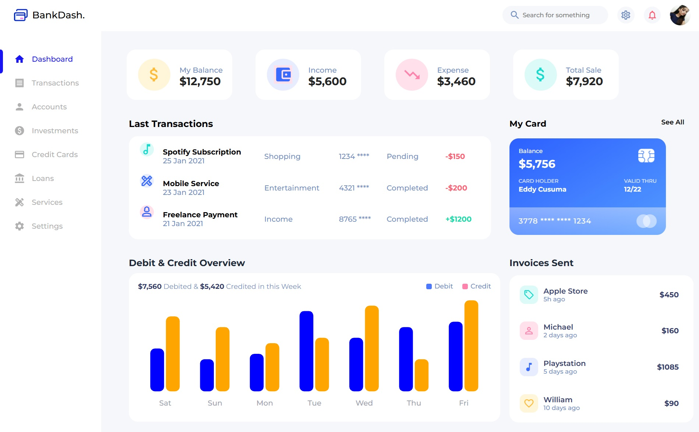

# BankDash - Finance Dashboard

BankDash is a modern and responsive financial Desktop dashboard built with **React**, **Material UI**, **Figma design **, **Recharts**, and **vanilla CSS**. It provides users with a sleek interface to manage their accounts, track transactions, visualize debit/credit activity, and review invoices efficiently.
 
 

 
 

## Tech Stack

- **React** – Frontend library for building the user interface.
- **Material UI** – Component library for modern UI elements.
- **Recharts** – For interactive charts and data visualization.
- **Figma** – Used for design prototyping.
- **Vanilla CSS** – Custom styling for fine-tuned control over the layout.

## Future Enhancements

- interactive Animations
- Dark mode support
- Responsive for mobile
- Multi-language support
- Add other sections of website

